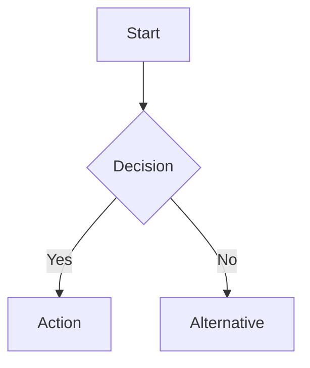

# Obsidian Markdown Syntax

Obsidian extends CommonMark and GFM with wiki-links, embeds, callouts, comments, and other syntax. Standard markdown is assumed knowledge — this reference covers only Obsidian-specific extensions.

> Adapted from [kepano/obsidian-skills](https://github.com/kepano/obsidian-skills) (MIT).

> Use `[[wiki-links]]` for vault notes (Obsidian tracks renames automatically), `[text](url)` for external URLs only.

## Wiki-Links

```markdown
[[Note Name]]                          Link to note
[[Note Name|Display Text]]             Custom display text
[[Note Name#Heading]]                  Link to heading
[[Note Name#^block-id]]                Link to block
[[#Heading in same note]]              Same-note heading link
[[subfolder/Note Name]]                Relative path link
```

Block IDs: append `^block-id` to any paragraph. For lists/quotes, place on a separate line after.

**When to use wiki-links in COG skills:**
- **Connections sections** — link to related braindumps, projects, frameworks
- **Source attribution** — reference another vault document as evidence
- **Cross-references** — bidirectional linking when content relates
- **Frontmatter references** — e.g., `consolidated_in: "[[consolidation-2026-04-03]]"` (always quote)

**Backlink awareness:** Creating `[[wiki-links]]` automatically gives the target document backlinks in Obsidian's graph. This is free — just link and the graph builds itself.

## Embeds

Prefix any wiki-link with `!` to embed content inline:

```markdown
![[Note Name]]                         Embed full note
![[Note Name#Heading]]                 Embed section
![[image.png]]                         Embed image
![[image.png|300]]                     Embed image with width (pixels)
![[document.pdf#page=3]]               Embed PDF page
```

Embeds are useful for COG skills that generate summary documents referencing detailed analyses — embed the analysis section rather than duplicating content.

## Callouts

```markdown
> [!note]
> Basic callout.

> [!warning] Custom Title
> Callout with a custom title.

> [!faq]- Collapsed by default
> Foldable callout (- collapsed, + expanded by default).
```

Common types: `note`, `tip`, `warning`, `info`, `example`, `quote`, `bug`, `danger`, `success`, `failure`, `question`, `abstract`, `todo`.

Callouts are useful in COG skill outputs for highlighting key insights, warnings, decisions, or action items visually.

## Comments

```markdown
This is visible %%but this is hidden%% in reading view.

%%
This entire block is hidden in reading view.
%%
```

Use comments for processing metadata or agent notes that shouldn't clutter the reading experience.

## Highlighting

```markdown
==Highlighted text== renders as a highlight in reading view.
```

## Math (LaTeX)

```markdown
Inline: $e^{i\pi} + 1 = 0$

Block:
$$
\frac{a}{b} = c
$$
```

Useful for COG notes involving formulas, metrics, or quantitative analysis.

## Diagrams (Mermaid)

````markdown

````

Supported diagram types: flowchart, sequence, class, state, gantt, pie, er, journey, mindmap, timeline, quadrant, sankey, xy.

To link Mermaid nodes to Obsidian notes: `class NodeName internal-link;`

Useful for COG skills generating architecture decisions, workflow analyses, or relationship maps.

## Footnotes

```markdown
Text with a footnote[^1].

[^1]: Footnote content here.

Inline footnote.^[This is inline.]
```
