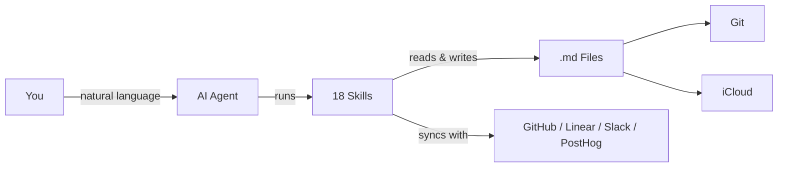
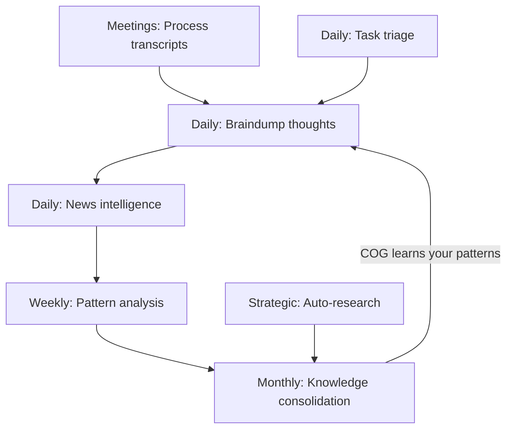

# COG: The Agentic Second Brain That Actually Self-Evolves

**Cognition + Obsidian + Git** — A self-evolving second brain powered by AI agents, markdown files, and version control. No database, no vendor lock-in — just `.md` files that think.

[Quick Start](#quick-start) | [Skills](#skills) | [Features](#features-at-a-glance) | [FAQ](#faq) | [SETUP.md](SETUP.md)

> Works with [Claude Code](https://claude.ai/download) &bull; [Kiro](https://kiro.dev/) &bull; [Antigravity CLI](https://github.com/google-gemini/antigravity) &bull; [OpenAI Codex](https://github.com/openai/codex) &bull; any AI that reads markdown



> **New to COG?** Watch the [2-minute walkthrough](https://youtube.com/PLACEHOLDER) to see it in action.

## Quick Start

**1. Clone & enter the repo:**
```bash
git clone https://github.com/huytieu/COG-second-brain.git
cd COG-second-brain
```

**2. Run onboarding in your agent:**

| Agent | Command | How it discovers skills |
|---|---|---|
| Claude Code | `code .` → "Run onboarding" | `.claude/skills/` (native) + `CLAUDE.md` |
| Kiro | Open folder → "setup COG" | `.kiro/powers/` (native keyword matching) |
| Antigravity CLI | `antigravity` → "Run onboarding" | `AGENTS.md` (reads markdown) |
| OpenAI Codex | `codex` → "Run onboarding" | `AGENTS.md` (reads markdown) |
| Other agents | Point at `AGENTS.md` → "Run onboarding" | `AGENTS.md` (reads markdown) |

Done — COG is personalized and ready in ~2 minutes. See [SETUP.md](SETUP.md) for optional config (Git sync, iCloud, Obsidian Tasks, etc.).

## Skills

### Core Skills (Personal Knowledge)

| Skill | What it does | Try saying... |
|---|---|---|
| **onboarding** | Personalize COG for your workflow (run first!) | "Run onboarding" |
| **braindump** | Capture raw thoughts with intelligent classification | "I need to braindump" |
| **daily-brief** | Verified news intelligence (7-day freshness) | "Give me my daily brief" |
| **url-dump** | Save URLs with auto-extracted insights | "Save this URL" |
| **scout** | Quick-triage URLs and tools — assess relevance, check vault coverage, recommend save or skip | "Scout this" / "Is this relevant?" |
| **weekly-checkin** | Cross-domain pattern analysis | "Weekly review" |
| **knowledge-consolidation** | Build frameworks from scattered insights, or run a lightweight vault health audit | "Consolidate my knowledge" / "Vault health" |
| **task-triage** | Clear overdue + due-today tasks from TASKS.md with evidence-based classification and accumulating rules | "Triage tasks" / "What's overdue?" |
| **meeting-transcript** | Process meeting recordings into structured decisions, action items, and team dynamics | "Process this meeting" |
| **publish-to-confluence** | Publish any vault markdown file to Confluence | "Publish this to Confluence" |

### Strategic Research

| Skill | What it does | Try saying... |
|---|---|---|
| **auto-research** | Deep strategic research engine — decomposes questions into parallel research threads with multiple agents | "Research the future of AI testing tools" |

### Role Packs (Personalized Recommendations)

COG matches your role during onboarding to a **role pack** that prioritizes the most relevant skills and integrations for you. Available role packs: Product Manager, Engineering Lead, Engineer, Designer, Founder, Marketer — or create your own from the template.

## The Evolution Cycle



- **Daily capture** — braindump raw thoughts; COG classifies by domain and extracts action items
- **Daily intelligence** — personalized news briefings with verified, sourced news
- **Meeting processing** — extract decisions, action items, and team dynamics from transcripts
- **Weekly reflection** — pattern analysis across all domains surfaces insights you'd miss
- **Monthly synthesis** — scattered notes become consolidated frameworks
- **Strategic research** — deep multi-agent investigation of strategic questions with real sources
- **Task hygiene** — automated triage of overdue items with accumulating rules

## Features at a Glance

| | | |
|---|---|---|
| **Self-Evolving** — Learns your patterns, auto-organizes content, builds frameworks | **Self-Healing** — Rename files or restructure; cross-references update automatically | **Verification-First** — Sources required, 7-day freshness, confidence levels on all analysis |
| **Privacy-First** — Local `.md` files, strict domain separation, no external servers | **Multi-Device** — iCloud sync to iPhone/iPad/Mac; Git for version history | **Obsidian Tasks** — `📅 YYYY-MM-DD` emoji format works with Tasks plugin dashboards |
| **Model Tier Routing** — Skills route sub-agents to `worker` / `specialist` / `architect` tiers; provider model mappings in each context file header | | |

## Your Vault

```
COG-second-brain/
├── .agents/skills/          # Skills — single source of truth (agentskills.io standard)
│
│   Generated by cog-sync.sh (never hand-edit):
├── .claude/skills/          # ⟵ copies for Claude Code native discovery
├── .kiro/powers/            # ⟵ Kiro format with keywords
├── CLAUDE.md                # ⟵ Claude-specific header + AGENTS.md
│
│   Hand-edited:
├── .cog/user-roles/      # User role packs (7) — personalized recommendations
├── AGENTS.md                # Framework docs (vault structure, rules, philosophy)
├── 00-inbox/                # Profiles, interests, integrations
├── 01-daily/                # Briefs & check-ins
├── 02-personal/             # Personal braindumps (private)
├── 03-professional/         # Professional braindumps & strategy
├── 04-projects/             # Per-project tracking
└── 05-knowledge/            # Consolidated insights & patterns
```

> **Real-world results:** 120+ braindumps processed, daily briefs with 95%+ source accuracy, 5 major strategic insights discovered — zero maintenance required.

### For Contributors

Skills live in `.agents/skills/[name]/SKILL.md` — the single source of truth. Running `./cog-sync.sh` generates native files for each tool:

```
.agents/skills/daily-brief/SKILL.md          ← you edit this
    ├─→ .claude/skills/daily-brief/SKILL.md  ← copy (Claude Code)
    └─→ .kiro/powers/cog-daily-brief/POWER.md ← Kiro format with keywords
```

`CLAUDE.md` is a hybrid file — a tool-specific header you can edit, with `AGENTS.md` content auto-appended below a marker. Never edit below the `<!-- AUTO-GENERATED -->` line.

Skills follow the [agentskills.io](https://agentskills.io) open standard. See [CONTRIBUTING.md](CONTRIBUTING.md) for the format and full details.

## FAQ

<details><summary><strong>Why not just use Notion / Roam / Obsidian alone?</strong></summary>

COG adds self-evolving intelligence on top. It doesn't just store — it learns, analyzes, and synthesizes insights automatically.
</details>

<details><summary><strong>How much does it cost?</strong></summary>

COG is free and open-source (MIT). You only pay for your AI agent's API usage.
</details>

<details><summary><strong>Is my data private?</strong></summary>

Yes. Everything is local markdown files. The AI agent's API is only called when you invoke a skill. No data stored on external servers.
</details>

<details><summary><strong>Can I customize or add skills?</strong></summary>

Yes — edit skills in `.agents/skills/[name]/SKILL.md` (source of truth), then run `./cog-sync.sh` to generate tool-specific files. See [CONTRIBUTING.md](CONTRIBUTING.md) for the skill format.
</details>

<details><summary><strong>What if I don't use Git?</strong></summary>

Git is optional but recommended for version history. COG works fine with just iCloud sync.
</details>

## Roadmap

- [x] ~~Gemini CLI + OpenAI Codex support~~ (shipped in v3.1)
- [x] ~~Upstream update system~~ (shipped in v3.2)
- [x] ~~Role packs & integration discovery~~ (shipped in v3.3)
- [x] ~~PM workflow skills & auto-research~~ (shipped in v3.4)
- [ ] Web interface for knowledge graph visualization
- [ ] Mobile-first commands (optimized for Obsidian mobile)
- [ ] Team collaboration features (with privacy preservation)
- [ ] Integration with calendar/task management tools

## Contributing & Support

| | | |
|---|---|---|
| [Contribute](CONTRIBUTING.md) | [Report bugs](https://github.com/huytieu/COG-second-brain/issues) | [Discussions](https://github.com/huytieu/COG-second-brain/discussions) |
| [Sponsor on GitHub](https://github.com/sponsors/huytieu) | [Buy me a coffee](https://buymeacoffee.com/0xlight) | [MIT License](LICENSE) |

## Acknowledgments

Built with [Claude Code](https://claude.ai/code), [Kiro](https://kiro.dev/), [Antigravity CLI](https://github.com/google-gemini/antigravity), [OpenAI Codex](https://github.com/openai/codex), and [Obsidian](https://obsidian.md/). Inspired by Zettelkasten, Building a Second Brain, and GTD.

## Star History

[](https://www.star-history.com/#huytieu/COG-second-brain&type=date&legend=top-left)

---

**TL;DR:** Clone, run onboarding, braindump daily. COG evolves with you — just `.md` files, any AI agent, zero maintenance.
